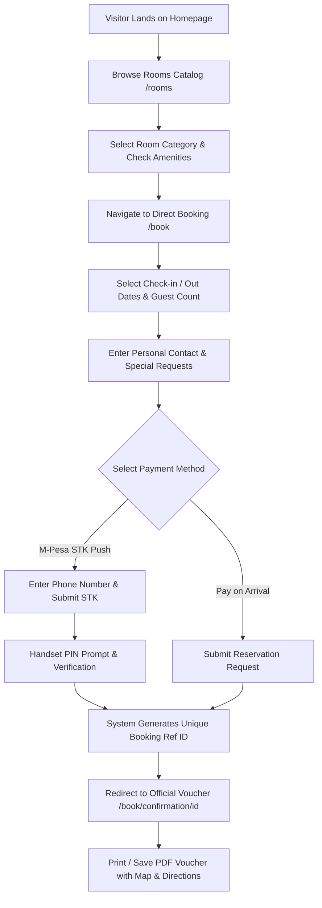
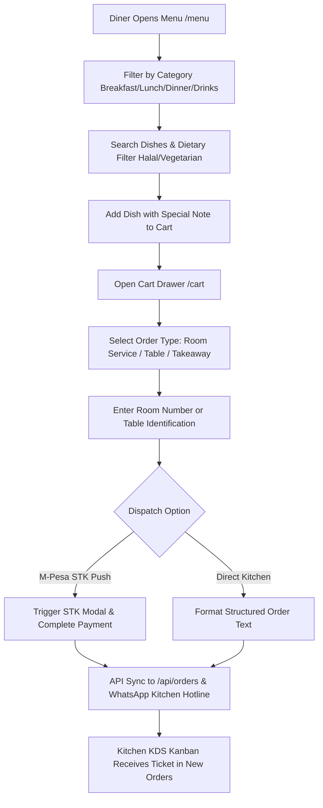
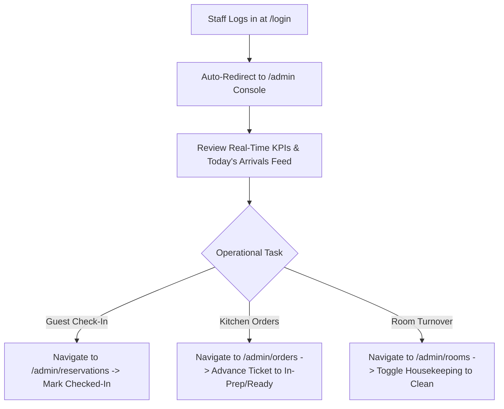

# DOC-013: User Flow & System Journey Maps

**Document ID:** `DOC-013`  
**Version:** `1.0`  
**Status:** `APPROVED`  

---

## 1. Primary Guest Booking Journey

---

## 2. Digital Menu & Food Ordering Journey

---

## 3. Front-Desk Operations Journey

---

## 4. Sign-Off

**Client Approval:** `___________________________` Date: `__________`  
