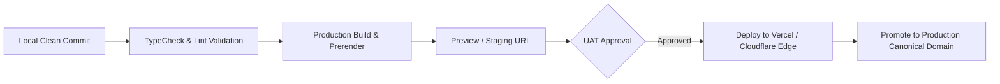

# DOC-032: Production Deployment & Rollback Plan

**Document ID:** `DOC-032`  
**Version:** `1.0`  
**Status:** `RELEASE BLUEPRINT`  

---

## 1. Deployment Execution Pipeline

---

## 2. Emergency Rollback Protocol

If critical unexpected downtime, data corruption, or payment gateway API errors occur during launch:
1. **Trigger Condition:** HTTP 500 error rate exceeding 1% or payment confirmation failure.
2. **Instant Edge Rollback:** In Vercel / Cloudflare dashboard, navigate to Deployments and click **"Instant Rollback"** to the previous stable release commit.
3. **DNS Fallback:** If hosting network is degraded, point domain DNS A-records to secondary edge CDN backup.
4. **Post-Mortem:** Conduct root cause analysis within 24 hours (`DOC-027`).

---

## 3. Sign-Off

**DevOps / Release Lead:** `___________________________` Date: `__________`  
